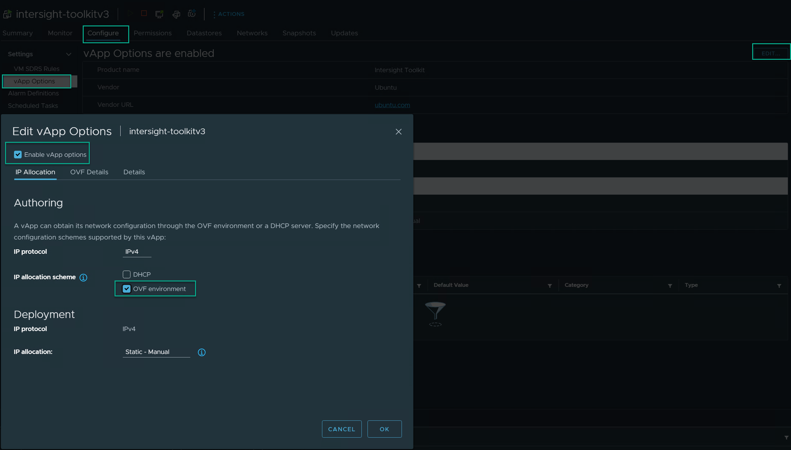
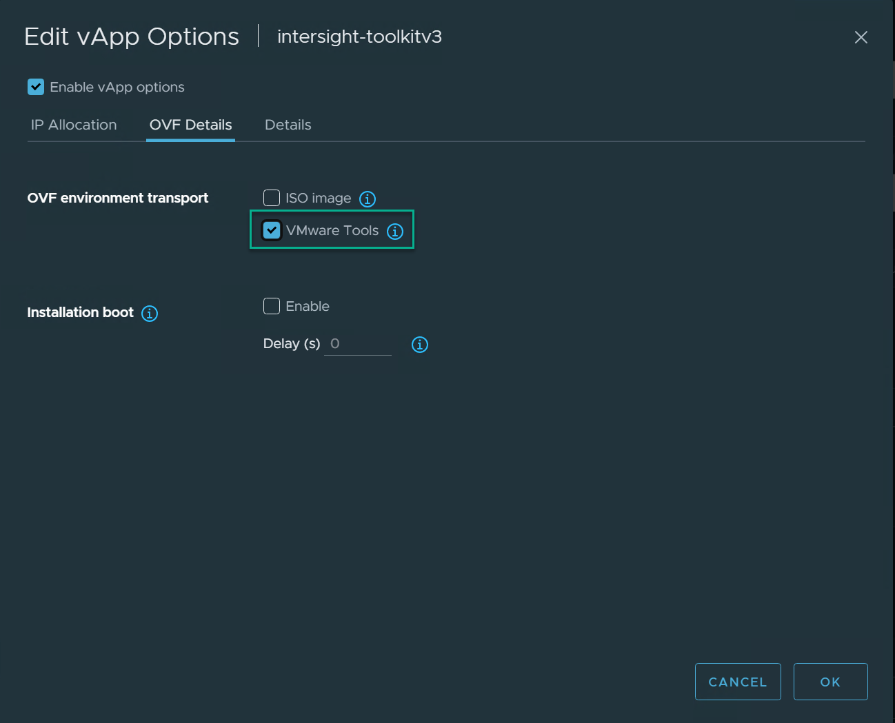
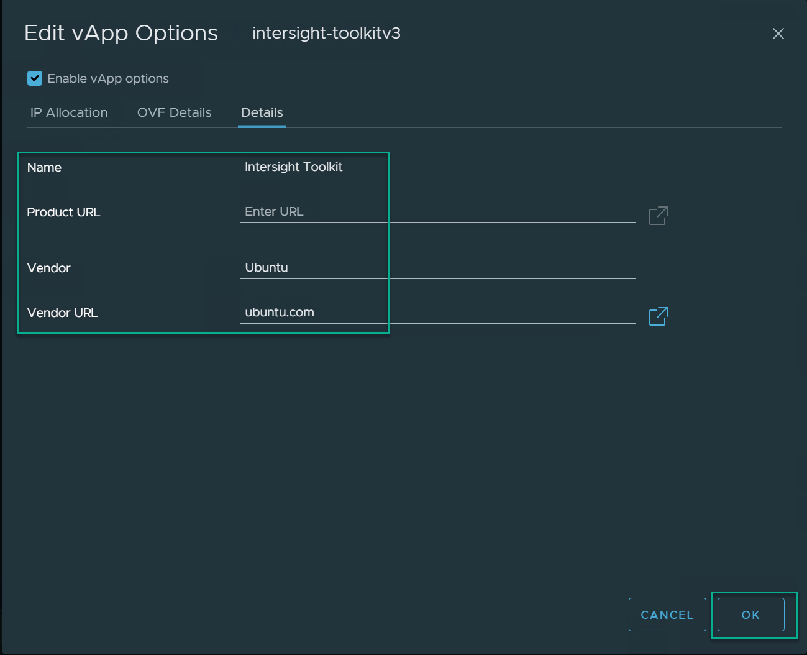
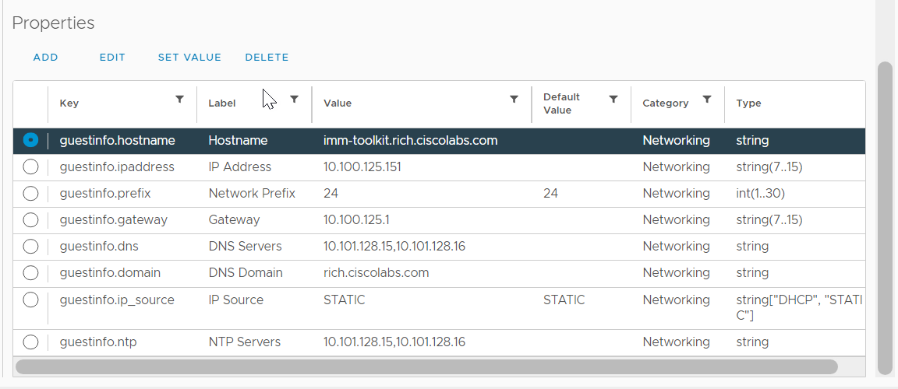

# Intersight Toolkit Setup Instructions

The purpose of this HashiCorp Packer example is to build an automation platform to manage Cisco Intersight.  The current example deployes a template in a VMware environment, which then can be used to create an OVA for distribution.  It provides an environment to perform automation with Ansible, PowerShell, Python, and Terraform.

## Updates/News

* 2023-11-18 - v2.0.1 - Moving to HashiCorp Packer - Guidance from https://tekanaid.com/posts/hashicorp-packer-build-ubuntu22-04-vmware
* 2023-05-04 - Initial Release

## Setup Environment

Install the following packages for Packer.

```sh
sudo apt install mkisofs whois -y
```

## Install Packer

```bash
sudo apt-get update && sudo apt-get install -y gnupg software-properties-common
wget -O- https://apt.releases.hashicorp.com/gpg | gpg --dearmor | \
sudo tee /usr/share/keyrings/hashicorp-archive-keyring.gpg
echo "deb [signed-by=/usr/share/keyrings/hashicorp-archive-keyring.gpg] \
https://apt.releases.hashicorp.com $(lsb_release -cs) main" | \
sudo tee /etc/apt/sources.list.d/hashicorp.list
sudo apt update -y
sudo apt-get install packer -y
```

## Generate a hashed password for the user-data file

Run the command below and when prompted for PASSWORD enter the Password desired for the User Account.

```bash
mkpasswd -m sha-512 --rounds=4096
```

You will get an encrypted password similar to the following:

```bash
Password: $6$KU2P9m78xF3n$noEN/CV.0R4qMLdDh/TloUplmJ0DLnqi6/cP7hHgfwUu.D0hMaD2sAfxDT3eHP5BQ3HdgDkKuIk8zBh0mDLzO1
```

* Copy the user-data.example to user-data

```bash
cd vmware/http/
cp user-data.example user-data
cd ../
```

* Update the hostname, username, password (with the hashed password), 
* Uncomment the authorized-keys if you would like to add a valid ssh-rsa public key for cloud deployments.
* Copy the variables.yaml.example to variables.yaml

```bash
cp variables.yaml.example to variables.yaml
```

* Use the defaults.yaml as an example source and make any modifications you would like to the deployment settings in variables.yaml.

## Setup Packer Sensitive Variables

```bash
export PKR_VAR_virtual_machine_password="same_password_as_mkpasswd_plain_text"
export PKR_VAR_vsphere_password="vcenter_password_plain_text"
```

## Running packer build with hcl

```sh
packer build -force -on-error=ask vmware.pkr.hcl
```

## Setup OVF Customization on Virtual Machine

* Create a Virtual Machine from the Template created by Packer.
* From the Virtual machine click `Configure` -> `vApp Options` -> `EDIT`
* Check `Enable vApp options`
* On the `IP Allocation` Tab check `OVF environment`



* Click the `OVF Details` tab and select `VMware Tools` as shown below.



* Enter the `Details`, similar to the example shown below.  Click `OK`.



* Shutdown the Virtual Machine.  And then Power it back on.
* Validate the vmtools are reporting the environment:

### Example

```
toolkit@localhost:~$ vmtoolsd --cmd "info-get guestinfo.ovfEnv"
<?xml version="1.0" encoding="UTF-8"?>
<Environment
     xmlns="http://schemas.dmtf.org/ovf/environment/1"
     xmlns:xsi="http://www.w3.org/2001/XMLSchema-instance"
     xmlns:oe="http://schemas.dmtf.org/ovf/environment/1"
     xmlns:ve="http://www.vmware.com/schema/ovfenv"
     oe:id=""
     ve:vCenterId="vm-11083">
   <PlatformSection>
      <Kind>VMware ESXi</Kind>
      <Version>8.0.1</Version>
      <Vendor>VMware, Inc.</Vendor>
      <Locale>en</Locale>
   </PlatformSection>
   <ve:EthernetAdapterSection>
      <ve:Adapter ve:mac="00:50:56:ba:7e:3d" ve:network="10.101.125.0-Mgmt" ve:unitNumber="7"/>
   </ve:EthernetAdapterSection>
</Environment>
toolkit@localhost:~$ 
```

* Power off the Virtual Machine.   You will then be able to edit the `vApp Properties`.  Fill in the attributes as outlined below.



- IP Source
  - Category: Networking
  - Description:
  - Key ID: guestinfo.ip_source
  - Label: IP Source
  - Type: string choice
  - Choice List: "DHCP", "STATIC"
  - Default value: STATIC
- Hostname
  - Category: Networking
  - Description: The Fully Qualified Domain Name
  - Key ID: guestinfo.hostname
  - Label: Hostname
  - Type: string
- IP Address
  - Category: Networking
  - Description:
  - Key ID: guestinfo.ipaddress
  - Label: IP Address
  - Type: string
  - Length: 7 to 15
- Network Prefix
  - Category: Networking
  - Description:
  - Key ID: guestinfo.prefix
  - Label: Network Prefix
  - Type: integer
  - range: 1 to 30
  - Default value: 24
- Gateway
  - Category: Networking
  - Description:
  - Key ID: guestinfo.gateway
  - Label: Gateway
  - Type: string
  - Length: 7 to 15
- DNS Servers
  - Category: Networking
  - Description: Use a comma to separate multiple servers.  i.e. 8.8.4.4,8.8.8.8
  - Key ID: guestinfo.dns
  - Label: DNS Servers
  - Type: string
- DNS Domains
  - Category: Networking
  - Description: Use a comma to separate multiple domains.  i.e. cisco.com,example.com
  - Key ID: guestinfo.domain
  - Label: DNS Domains
  - Type: string
- NTP Servers
  - Category: Networking
  - Description: Use a comma to separate multiple servers.  i.e. 0.pool.ntp.org,1.pool.ntp.org
  - Key ID: guestinfo.ntp
  - Label: NTP Servers
  - Type: string

## Create OVA From VM or VM Template

* Download the VMware OVF Tool from the Broadcom developer WebSite

[OVF Tool](https://developer.broadcom.com/tools/open-virtualization-format-ovf-tool/latest)

* Run the Installation
* Power off the Virtual Machine

```powershell
cd %ProgramFiles%\VMware\VMware OVF Tool
ovftool.exe vi://<vcenter-url>/<datacenter>/vm/<vm-folder> %HOMEPATH%\Downloads\intersight-toolkitv0.1.ova
```

### Example
```powershell
C:\Program Files\VMware\VMware OVF Tool>ovftool.exe vi://vcenter.rich.ciscolabs.com/Richfield/vm/intersight-toolkitv3 HOMEPATH%\Downloads\intersight-toolkitv3.ova
Enter login information for source vi://vcenter.rich.ciscolabs.com/
Username: <admin-credentials>
Password: ********
Opening VI source: vi://administrator%40rich.local@vcenter.rich.ciscolabs.com:443/Richfield/vm/intersight-toolkitv3
Opening OVA target: \Users\tyscott\Downloads\intersight-toolkitv3.ova
Writing OVA package: \Users\tyscott\Downloads\intersight-toolkitv3.ova
```

## Troubleshooting

- If packer gets stuck on `Waiting for IP` you may want to check your DHCP server.
- Recently had a problem where the Open-SSH Server did not Install properly

```
sudo apt remove openssh-server
sudo apt install openssh-server
```

## Packer example output

Below is an example of a successful run of the packer image builder for ubuntu-22.04

```
tyscott@rich.ciscolabs.com@lnx2:~/scotttyso/toolkitv1.0.11-16342$ packer build -force -on-error=ask vmware.pkr.hcl 
vsphere-iso.vm: output will be in this color.

==> vsphere-iso.vm: File /home/tyscott@rich.ciscolabs.com/.cache/packer/c34a99823b81049d1be9aad8fab0acdfc78304e0.iso already uploaded; continuing
==> vsphere-iso.vm: Creating CD disk...
    vsphere-iso.vm: Warning: creating filesystem with Joliet extensions but without Rock Ridge
    vsphere-iso.vm: extensions. It is highly recommended to add Rock Ridge.
    vsphere-iso.vm: I: -input-charset not specified, using utf-8 (detected in locale settings)
    vsphere-iso.vm: Total translation table size: 0
    vsphere-iso.vm: Total rockridge attributes bytes: 0
    vsphere-iso.vm: Total directory bytes: 156
    vsphere-iso.vm: Path table size(bytes): 10
    vsphere-iso.vm: Max brk space used 0
    vsphere-iso.vm: 181 extents written (0 MB)
    vsphere-iso.vm: Done copying paths from CD_dirs
==> vsphere-iso.vm: File [NVMe-DS1] packer_cache//c34a99823b81049d1be9aad8fab0acdfc78304e0.iso already exists; skipping upload.
==> vsphere-iso.vm: Uploading packer2411715681.iso to packer_cache/packer2411715681.iso
==> vsphere-iso.vm: Creating VM...
==> vsphere-iso.vm: Customizing hardware...
==> vsphere-iso.vm: Adding SATA controller...
==> vsphere-iso.vm: Mounting ISO images...
==> vsphere-iso.vm: Adding configuration parameters...
==> vsphere-iso.vm: Starting HTTP server on port 8876
==> vsphere-iso.vm: Set boot order...
==> vsphere-iso.vm: Power on VM...
==> vsphere-iso.vm: Waiting 5s for boot...
==> vsphere-iso.vm: HTTP server is working at http://10.101.128.25:8876/
==> vsphere-iso.vm: Typing boot command...
==> vsphere-iso.vm: Waiting for IP...
==> vsphere-iso.vm: IP address: 10.101.125.107
==> vsphere-iso.vm: Using SSH communicator to connect: 10.101.125.107
==> vsphere-iso.vm: Waiting for SSH to become available...
==> vsphere-iso.vm: Connected to SSH!
==> vsphere-iso.vm: Provisioning with shell script: ./scripts/setup.sh
==> vsphere-iso.vm: /tmp/script_1613.sh: line 7: grub: command not found
    vsphere-iso.vm: > Creating cleanup script ...
    vsphere-iso.vm: > Changeing script permissions for execution ...
==> vsphere-iso.vm: Cloning into 'intersight-tools'...
    vsphere-iso.vm: Collecting argparse
    vsphere-iso.vm:   Downloading argparse-1.4.0-py2.py3-none-any.whl (23 kB)
    vsphere-iso.vm: Collecting collection
    vsphere-iso.vm:   Downloading collection-0.1.6.tar.gz (5.0 kB)
    vsphere-iso.vm:   Preparing metadata (setup.py): started
    vsphere-iso.vm:   Preparing metadata (setup.py): finished with status 'done'
    vsphere-iso.vm: Collecting dotmap
    vsphere-iso.vm:   Downloading dotmap-1.3.30-py3-none-any.whl (11 kB)
    vsphere-iso.vm: Collecting GitPython
    vsphere-iso.vm:   Downloading GitPython-3.1.43-py3-none-any.whl (207 kB)
    vsphere-iso.vm:      ━━━━━━━━━━━━━━━━━━━━━━━━━━━━━━━━━━━━━━━ 207.3/207.3 KB 2.0 MB/s eta 0:00:00
    vsphere-iso.vm: Collecting git_status_checker
    vsphere-iso.vm:   Downloading git_status_checker-2020.4.14-py3-none-any.whl (24 kB)
    vsphere-iso.vm: Collecting inflect
    vsphere-iso.vm:   Downloading inflect-7.2.1-py3-none-any.whl (34 kB)
    vsphere-iso.vm: Collecting intersight-auth
    vsphere-iso.vm:   Downloading intersight_auth-0.2.4-py3-none-any.whl (4.6 kB)
    vsphere-iso.vm: Collecting ipaddress
    vsphere-iso.vm:   Downloading ipaddress-1.0.23-py2.py3-none-any.whl (18 kB)
    vsphere-iso.vm: Requirement already satisfied: jinja2 in /usr/lib/python3/dist-packages (from -r requirements.txt (line 10)) (3.0.3)
    vsphere-iso.vm: Collecting json_ref_dict
    vsphere-iso.vm:   Downloading json_ref_dict-0.7.2-py3-none-any.whl (13 kB)
    vsphere-iso.vm: Collecting lxml
    vsphere-iso.vm:   Downloading lxml-5.2.2-cp310-cp310-manylinux_2_28_x86_64.whl (5.0 MB)
    vsphere-iso.vm:      ━━━━━━━━━━━━━━━━━━━━━━━━━━━━━━━━━━━━━━━━ 5.0/5.0 MB 7.2 MB/s eta 0:00:00
    vsphere-iso.vm: Collecting numpy
    vsphere-iso.vm:   Downloading numpy-1.26.4-cp310-cp310-manylinux_2_17_x86_64.manylinux2014_x86_64.whl (18.2 MB)
    vsphere-iso.vm:      ━━━━━━━━━━━━━━━━━━━━━━━━━━━━━━━━━━━━━━━━ 18.2/18.2 MB 7.1 MB/s eta 0:00:00
    vsphere-iso.vm: Collecting openpyxl
    vsphere-iso.vm:   Downloading openpyxl-3.1.2-py2.py3-none-any.whl (249 kB)
    vsphere-iso.vm:      ━━━━━━━━━━━━━━━━━━━━━━━━━━━━━━━━━━━━━━━ 250.0/250.0 KB 6.7 MB/s eta 0:00:00
    vsphere-iso.vm: Collecting ordered_set
    vsphere-iso.vm:   Downloading ordered_set-4.1.0-py3-none-any.whl (7.6 kB)
    vsphere-iso.vm: Collecting phonenumbers
    vsphere-iso.vm:   Downloading phonenumbers-8.13.37-py2.py3-none-any.whl (2.6 MB)
    vsphere-iso.vm:      ━━━━━━━━━━━━━━━━━━━━━━━━━━━━━━━━━━━━━━━━ 2.6/2.6 MB 7.1 MB/s eta 0:00:00
    vsphere-iso.vm: Collecting pycryptodome
    vsphere-iso.vm:   Downloading pycryptodome-3.20.0-cp35-abi3-manylinux_2_17_x86_64.manylinux2014_x86_64.whl (2.1 MB)
    vsphere-iso.vm:      ━━━━━━━━━━━━━━━━━━━━━━━━━━━━━━━━━━━━━━━━ 2.1/2.1 MB 7.0 MB/s eta 0:00:00
    vsphere-iso.vm: Requirement already satisfied: pexpect in /usr/lib/python3/dist-packages (from -r requirements.txt (line 18)) (4.8.0)
    vsphere-iso.vm: Collecting pyopenssl==22.0.0
    vsphere-iso.vm:   Downloading pyOpenSSL-22.0.0-py2.py3-none-any.whl (55 kB)
    vsphere-iso.vm:      ━━━━━━━━━━━━━━━━━━━━━━━━━━━━━━━━━━━━━━━━ 55.8/55.8 KB 5.1 MB/s eta 0:00:00
    vsphere-iso.vm: Requirement already satisfied: pytz in /usr/lib/python3/dist-packages (from -r requirements.txt (line 20)) (2022.1)
    vsphere-iso.vm: Collecting pyvmomi
    vsphere-iso.vm:   Downloading pyvmomi-8.0.2.0.1.tar.gz (852 kB)
    vsphere-iso.vm:      ━━━━━━━━━━━━━━━━━━━━━━━━━━━━━━━━━━━━━━━ 852.2/852.2 KB 7.0 MB/s eta 0:00:00
    vsphere-iso.vm:   Preparing metadata (setup.py): started
    vsphere-iso.vm:   Preparing metadata (setup.py): finished with status 'done'
    vsphere-iso.vm: Requirement already satisfied: requests in /usr/lib/python3/dist-packages (from -r requirements.txt (line 22)) (2.25.1)
    vsphere-iso.vm: Requirement already satisfied: simplejson in /usr/lib/python3/dist-packages (from -r requirements.txt (line 23)) (3.17.6)
    vsphere-iso.vm: Requirement already satisfied: six in /usr/lib/python3/dist-packages (from -r requirements.txt (line 24)) (1.16.0)
    vsphere-iso.vm: Collecting stdiomask
    vsphere-iso.vm:   Downloading stdiomask-0.0.6.tar.gz (3.6 kB)
    vsphere-iso.vm:   Installing build dependencies: started
    vsphere-iso.vm:   Installing build dependencies: finished with status 'done'
    vsphere-iso.vm:   Getting requirements to build wheel: started
    vsphere-iso.vm:   Getting requirements to build wheel: finished with status 'done'
    vsphere-iso.vm:   Preparing metadata (pyproject.toml): started
    vsphere-iso.vm:   Preparing metadata (pyproject.toml): finished with status 'done'
    vsphere-iso.vm: Collecting stringcase
    vsphere-iso.vm:   Downloading stringcase-1.2.0.tar.gz (3.0 kB)
    vsphere-iso.vm:   Preparing metadata (setup.py): started
    vsphere-iso.vm:   Preparing metadata (setup.py): finished with status 'done'
    vsphere-iso.vm: Collecting tabulate
    vsphere-iso.vm:   Downloading tabulate-0.9.0-py3-none-any.whl (35 kB)
    vsphere-iso.vm: Collecting ucscsdk
    vsphere-iso.vm:   Downloading ucscsdk-0.9.0.5-py2.py3-none-any.whl (5.4 MB)
    vsphere-iso.vm:      ━━━━━━━━━━━━━━━━━━━━━━━━━━━━━━━━━━━━━━━━ 5.4/5.4 MB 7.2 MB/s eta 0:00:00
    vsphere-iso.vm: Collecting validators==0.11.0
    vsphere-iso.vm:   Downloading validators-0.11.0.tar.gz (19 kB)
    vsphere-iso.vm:   Preparing metadata (setup.py): started
    vsphere-iso.vm:   Preparing metadata (setup.py): finished with status 'done'
    vsphere-iso.vm: Collecting cryptography>=35.0
    vsphere-iso.vm:   Downloading cryptography-42.0.7-cp39-abi3-manylinux_2_28_x86_64.whl (3.8 MB)
    vsphere-iso.vm:      ━━━━━━━━━━━━━━━━━━━━━━━━━━━━━━━━━━━━━━━━ 3.8/3.8 MB 7.3 MB/s eta 0:00:00
    vsphere-iso.vm: Collecting decorator>=3.4.0
    vsphere-iso.vm:   Downloading decorator-5.1.1-py3-none-any.whl (9.1 kB)
    vsphere-iso.vm: Collecting gitdb<5,>=4.0.1
    vsphere-iso.vm:   Downloading gitdb-4.0.11-py3-none-any.whl (62 kB)
    vsphere-iso.vm:      ━━━━━━━━━━━━━━━━━━━━━━━━━━━━━━━━━━━━━━━━ 62.7/62.7 KB 5.3 MB/s eta 0:00:00
    vsphere-iso.vm: Requirement already satisfied: pyyaml in /usr/lib/python3/dist-packages (from git_status_checker->-r requirements.txt (line 6)) (5.4.1)
    vsphere-iso.vm: Collecting typeguard>=4.0.1
    vsphere-iso.vm:   Downloading typeguard-4.2.1-py3-none-any.whl (34 kB)
    vsphere-iso.vm: Collecting typing-extensions
    vsphere-iso.vm:   Downloading typing_extensions-4.11.0-py3-none-any.whl (34 kB)
    vsphere-iso.vm: Requirement already satisfied: more-itertools in /usr/lib/python3/dist-packages (from inflect->-r requirements.txt (line 7)) (8.10.0)
    vsphere-iso.vm: Collecting cryptography>=35.0
    vsphere-iso.vm:   Downloading cryptography-37.0.4-cp36-abi3-manylinux_2_24_x86_64.whl (4.1 MB)
    vsphere-iso.vm:      ━━━━━━━━━━━━━━━━━━━━━━━━━━━━━━━━━━━━━━━━ 4.1/4.1 MB 7.2 MB/s eta 0:00:00
    vsphere-iso.vm: Collecting requests
    vsphere-iso.vm:   Downloading requests-2.31.0-py3-none-any.whl (62 kB)
    vsphere-iso.vm:      ━━━━━━━━━━━━━━━━━━━━━━━━━━━━━━━━━━━━━━━━ 62.6/62.6 KB 5.2 MB/s eta 0:00:00
    vsphere-iso.vm: Requirement already satisfied: jsonpointer~=2.0 in /usr/lib/python3/dist-packages (from json_ref_dict->-r requirements.txt (line 11)) (2.0)
    vsphere-iso.vm: Collecting et-xmlfile
    vsphere-iso.vm:   Downloading et_xmlfile-1.1.0-py3-none-any.whl (4.7 kB)
    vsphere-iso.vm: Collecting charset-normalizer<4,>=2
    vsphere-iso.vm:   Downloading charset_normalizer-3.3.2-cp310-cp310-manylinux_2_17_x86_64.manylinux2014_x86_64.whl (142 kB)
    vsphere-iso.vm:      ━━━━━━━━━━━━━━━━━━━━━━━━━━━━━━━━━━━━━━━ 142.1/142.1 KB 6.2 MB/s eta 0:00:00
    vsphere-iso.vm: Requirement already satisfied: urllib3<3,>=1.21.1 in /usr/lib/python3/dist-packages (from requests->-r requirements.txt (line 22)) (1.26.5)
    vsphere-iso.vm: Requirement already satisfied: idna<4,>=2.5 in /usr/lib/python3/dist-packages (from requests->-r requirements.txt (line 22)) (3.3)
    vsphere-iso.vm: Requirement already satisfied: certifi>=2017.4.17 in /usr/lib/python3/dist-packages (from requests->-r requirements.txt (line 22)) (2020.6.20)
    vsphere-iso.vm: Requirement already satisfied: pyparsing in /usr/lib/python3/dist-packages (from ucscsdk->-r requirements.txt (line 28)) (2.4.7)
    vsphere-iso.vm: Collecting cffi>=1.12
    vsphere-iso.vm:   Downloading cffi-1.16.0-cp310-cp310-manylinux_2_17_x86_64.manylinux2014_x86_64.whl (443 kB)
    vsphere-iso.vm:      ━━━━━━━━━━━━━━━━━━━━━━━━━━━━━━━━━━━━━━━ 443.9/443.9 KB 6.8 MB/s eta 0:00:00
    vsphere-iso.vm: Collecting smmap<6,>=3.0.1
    vsphere-iso.vm:   Downloading smmap-5.0.1-py3-none-any.whl (24 kB)
    vsphere-iso.vm: Collecting pycparser
    vsphere-iso.vm:   Downloading pycparser-2.22-py3-none-any.whl (117 kB)
    vsphere-iso.vm:      ━━━━━━━━━━━━━━━━━━━━━━━━━━━━━━━━━━━━━━━ 117.6/117.6 KB 6.0 MB/s eta 0:00:00
    vsphere-iso.vm: Building wheels for collected packages: validators, collection, pyvmomi, stdiomask, stringcase
    vsphere-iso.vm:   Building wheel for validators (setup.py): started
    vsphere-iso.vm:   Building wheel for validators (setup.py): finished with status 'done'
    vsphere-iso.vm:   Created wheel for validators: filename=validators-0.11.0-py3-none-any.whl size=13324 sha256=f26fc0ff2468b323d53d7fe85efa32dafafb3939bb0f08d767a9667e7aba9f42
    vsphere-iso.vm:   Stored in directory: /root/.cache/pip/wheels/0a/6f/e8/88d4933836f574955daed74f995e9e4979ee5a2e62f10ab181
    vsphere-iso.vm:   Building wheel for collection (setup.py): started
    vsphere-iso.vm:   Building wheel for collection (setup.py): finished with status 'done'
    vsphere-iso.vm:   Created wheel for collection: filename=collection-0.1.6-py3-none-any.whl size=5115 sha256=4436d81dcbab9d5c037cd75fb0af747f0a29572ccd2e2afafaaec50fea641e1f
    vsphere-iso.vm:   Stored in directory: /root/.cache/pip/wheels/a5/70/eb/1d28795e9384ab3b9be6359bdde9e1652f6e7dab9d26844f70
    vsphere-iso.vm:   Building wheel for pyvmomi (setup.py): started
    vsphere-iso.vm:   Building wheel for pyvmomi (setup.py): finished with status 'done'
    vsphere-iso.vm:   Created wheel for pyvmomi: filename=pyvmomi-8.0.2.0.1-py2.py3-none-any.whl size=322398 sha256=3569ad5c266099092ed069ada087e45a96f2bd09c023060d307e1d9ee7d31bd6
    vsphere-iso.vm:   Stored in directory: /root/.cache/pip/wheels/e8/95/53/85f5fbc3fb95c72a838abaae72f408fe29799b6c088e729155
    vsphere-iso.vm:   Building wheel for stdiomask (pyproject.toml): started
    vsphere-iso.vm:   Building wheel for stdiomask (pyproject.toml): finished with status 'done'
    vsphere-iso.vm:   Created wheel for stdiomask: filename=stdiomask-0.0.6-py3-none-any.whl size=3321 sha256=954c75e0b05edeef743150d639060fe8d8f6a62d73edb8bc2cd0412a65bb428d
    vsphere-iso.vm:   Stored in directory: /root/.cache/pip/wheels/6c/00/4b/0715696f101d7376f67a83cf3d545feb8c241eeee75b80bb6f
    vsphere-iso.vm:   Building wheel for stringcase (setup.py): started
    vsphere-iso.vm:   Building wheel for stringcase (setup.py): finished with status 'done'
    vsphere-iso.vm:   Created wheel for stringcase: filename=stringcase-1.2.0-py3-none-any.whl size=3587 sha256=8e8f07ac0774afd58a52472cfce43f943f5c0a62104f34383dcb06b4a9db140e
    vsphere-iso.vm:   Stored in directory: /root/.cache/pip/wheels/31/ba/22/1a2d952a9ce8aa86e42fda41e2c87fdaf20e238c88bf8df013
    vsphere-iso.vm: Successfully built validators collection pyvmomi stdiomask stringcase
    vsphere-iso.vm: Installing collected packages: stringcase, stdiomask, phonenumbers, ipaddress, dotmap, collection, argparse, ucscsdk, typing-extensions, tabulate, smmap, pyvmomi, pycryptodome, pycparser, ordered_set, numpy, lxml, json_ref_dict, git_status_checker, et-xmlfile, decorator, charset-normalizer, validators, typeguard, requests, openpyxl, gitdb, cffi, inflect, GitPython, cryptography, pyopenssl, intersight-auth
    vsphere-iso.vm:   Attempting uninstall: requests
    vsphere-iso.vm:     Found existing installation: requests 2.25.1
    vsphere-iso.vm:     Not uninstalling requests at /usr/lib/python3/dist-packages, outside environment /usr
    vsphere-iso.vm:     Can't uninstall 'requests'. No files were found to uninstall.
    vsphere-iso.vm:   Attempting uninstall: cryptography
    vsphere-iso.vm:     Found existing installation: cryptography 3.4.8
    vsphere-iso.vm:     Not uninstalling cryptography at /usr/lib/python3/dist-packages, outside environment /usr
    vsphere-iso.vm:     Can't uninstall 'cryptography'. No files were found to uninstall.
    vsphere-iso.vm:   Attempting uninstall: pyopenssl
    vsphere-iso.vm:     Found existing installation: pyOpenSSL 21.0.0
    vsphere-iso.vm:     Not uninstalling pyopenssl at /usr/lib/python3/dist-packages, outside environment /usr
    vsphere-iso.vm:     Can't uninstall 'pyOpenSSL'. No files were found to uninstall.
    vsphere-iso.vm: Successfully installed GitPython-3.1.43 argparse-1.4.0 cffi-1.16.0 charset-normalizer-3.3.2 collection-0.1.6 cryptography-37.0.4 decorator-5.1.1 dotmap-1.3.30 et-xmlfile-1.1.0 git_status_checker-2020.4.14 gitdb-4.0.11 inflect-7.2.1 intersight-auth-0.2.4 ipaddress-1.0.23 json_ref_dict-0.7.2 lxml-5.2.2 numpy-1.26.4 openpyxl-3.1.2 ordered_set-4.1.0 phonenumbers-8.13.37 pycparser-2.22 pycryptodome-3.20.0 pyopenssl-22.0.0 pyvmomi-8.0.2.0.1 requests-2.31.0 smmap-5.0.1 stdiomask-0.0.6 stringcase-1.2.0 tabulate-0.9.0 typeguard-4.2.1 typing-extensions-4.11.0 ucscsdk-0.9.0.5 validators-0.11.0
==> vsphere-iso.vm: WARNING: Running pip as the 'root' user can result in broken permissions and conflicting behaviour with the system package manager. It is recommended to use a virtual environment instead: https://pip.pypa.io/warnings/venv
    vsphere-iso.vm: Collecting intersight
    vsphere-iso.vm:   Downloading intersight-1.0.11.16711.tar.gz (22.4 MB)
    vsphere-iso.vm:      ━━━━━━━━━━━━━━━━━━━━━━━━━━━━━━━━━━━━━━━━ 22.4/22.4 MB 6.6 MB/s eta 0:00:00
    vsphere-iso.vm:   Preparing metadata (setup.py): started
    vsphere-iso.vm:   Preparing metadata (setup.py): finished with status 'done'
    vsphere-iso.vm: Collecting pem>=19.3.0
    vsphere-iso.vm:   Downloading pem-23.1.0-py3-none-any.whl (9.2 kB)
    vsphere-iso.vm: Requirement already satisfied: pycryptodome>=3.9.0 in /usr/local/lib/python3.10/dist-packages (from intersight) (3.20.0)
    vsphere-iso.vm: Collecting python-dateutil
    vsphere-iso.vm:   Downloading python_dateutil-2.9.0.post0-py2.py3-none-any.whl (229 kB)
    vsphere-iso.vm:      ━━━━━━━━━━━━━━━━━━━━━━━━━━━━━━━━━━━━━━━ 229.9/229.9 KB 6.2 MB/s eta 0:00:00
    vsphere-iso.vm: Requirement already satisfied: urllib3>=1.25.3 in /usr/lib/python3/dist-packages (from intersight) (1.26.5)
    vsphere-iso.vm: Requirement already satisfied: six>=1.5 in /usr/lib/python3/dist-packages (from python-dateutil->intersight) (1.16.0)
    vsphere-iso.vm: Building wheels for collected packages: intersight
    vsphere-iso.vm:   Building wheel for intersight (setup.py): started
    vsphere-iso.vm:   Building wheel for intersight (setup.py): finished with status 'done'
    vsphere-iso.vm:   Created wheel for intersight: filename=intersight-1.0.11.16711-py3-none-any.whl size=47088294 sha256=d1d13193bd603cea00a8b0613bc76131be3c68d837dc67262e8e877b45420c75
    vsphere-iso.vm:   Stored in directory: /root/.cache/pip/wheels/dc/2d/cc/5b6d2c44616737d99a83f4ea29eaa98557de5ce9797f61ceca
    vsphere-iso.vm: Successfully built intersight
    vsphere-iso.vm: Installing collected packages: python-dateutil, pem, intersight
    vsphere-iso.vm: Successfully installed intersight-1.0.11.16711 pem-23.1.0 python-dateutil-2.9.0.post0
==> vsphere-iso.vm: WARNING: Running pip as the 'root' user can result in broken permissions and conflicting behaviour with the system package manager. It is recommended to use a virtual environment instead: https://pip.pypa.io/warnings/venv
    vsphere-iso.vm: Starting galaxy collection install process
    vsphere-iso.vm: Process install dependency map
    vsphere-iso.vm: Starting collection install process
    vsphere-iso.vm: Installing 'cisco.intersight:2.0.9' to '/home/toolkit/.ansible/collections/ansible_collections/cisco/intersight'
    vsphere-iso.vm: Downloading https://galaxy.ansible.com/api/v3/plugin/ansible/content/published/collections/artifacts/cisco-intersight-2.0.9.tar.gz to /home/toolkit/.ansible/tmp/ansible-local-1676bvoqdsra/tmpccki95dy
    vsphere-iso.vm: cisco.intersight (2.0.9) was installed successfully
    vsphere-iso.vm: powershell 7.4.2 from Microsoft PowerShell** installed
    vsphere-iso.vm: Hit:1 http://us.archive.ubuntu.com/ubuntu jammy InRelease
    vsphere-iso.vm: Hit:2 http://us.archive.ubuntu.com/ubuntu jammy-updates InRelease
    vsphere-iso.vm: Hit:3 http://us.archive.ubuntu.com/ubuntu jammy-backports InRelease
    vsphere-iso.vm: Hit:4 http://us.archive.ubuntu.com/ubuntu jammy-security InRelease
    vsphere-iso.vm: Reading package lists...
    vsphere-iso.vm: Reading package lists...
    vsphere-iso.vm: Building dependency tree...
    vsphere-iso.vm: Reading state information...
    vsphere-iso.vm: gnupg is already the newest version (2.2.27-3ubuntu2.1).
    vsphere-iso.vm: gnupg set to manually installed.
    vsphere-iso.vm: The following packages will be upgraded:
    vsphere-iso.vm:   python3-software-properties software-properties-common
    vsphere-iso.vm: 2 upgraded, 0 newly installed, 0 to remove and 58 not upgraded.
    vsphere-iso.vm: Need to get 42.9 kB of archives.
    vsphere-iso.vm: After this operation, 5120 B of additional disk space will be used.
    vsphere-iso.vm: Get:1 http://us.archive.ubuntu.com/ubuntu jammy-updates/main amd64 software-properties-common all 0.99.22.9 [14.1 kB]
    vsphere-iso.vm: Get:2 http://us.archive.ubuntu.com/ubuntu jammy-updates/main amd64 python3-software-properties all 0.99.22.9 [28.8 kB]
==> vsphere-iso.vm: debconf: unable to initialize frontend: Dialog
==> vsphere-iso.vm: debconf: (Dialog frontend will not work on a dumb terminal, an emacs shell buffer, or without a controlling terminal.)
==> vsphere-iso.vm: debconf: falling back to frontend: Readline
==> vsphere-iso.vm: debconf: unable to initialize frontend: Readline
==> vsphere-iso.vm: debconf: (This frontend requires a controlling tty.)
==> vsphere-iso.vm: debconf: falling back to frontend: Teletype
==> vsphere-iso.vm: dpkg-preconfigure: unable to re-open stdin:
    vsphere-iso.vm: Fetched 42.9 kB in 0s (90.2 kB/s)
    vsphere-iso.vm: (Reading database ... 119905 files and directories currently installed.)
    vsphere-iso.vm: Preparing to unpack .../software-properties-common_0.99.22.9_all.deb ...
    vsphere-iso.vm: Unpacking software-properties-common (0.99.22.9) over (0.99.22.7) ...
    vsphere-iso.vm: Preparing to unpack .../python3-software-properties_0.99.22.9_all.deb ...
    vsphere-iso.vm: Unpacking python3-software-properties (0.99.22.9) over (0.99.22.7) ...
    vsphere-iso.vm: Setting up python3-software-properties (0.99.22.9) ...
    vsphere-iso.vm: Setting up software-properties-common (0.99.22.9) ...
    vsphere-iso.vm: Processing triggers for man-db (2.10.2-1) ...
    vsphere-iso.vm: Processing triggers for dbus (1.12.20-2ubuntu4.1) ...
    vsphere-iso.vm:
    vsphere-iso.vm: Running kernel seems to be up-to-date.
    vsphere-iso.vm:
    vsphere-iso.vm: Services to be restarted:
    vsphere-iso.vm:
    vsphere-iso.vm: Service restarts being deferred:
    vsphere-iso.vm:  systemctl restart networkd-dispatcher.service
    vsphere-iso.vm:  systemctl restart unattended-upgrades.service
    vsphere-iso.vm:
    vsphere-iso.vm: No containers need to be restarted.
    vsphere-iso.vm:
    vsphere-iso.vm: No user sessions are running outdated binaries.
    vsphere-iso.vm:
    vsphere-iso.vm: No VM guests are running outdated hypervisor (qemu) binaries on this host.
==> vsphere-iso.vm: --2024-05-19 00:25:02--  https://apt.releases.hashicorp.com/gpg
==> vsphere-iso.vm: Resolving apt.releases.hashicorp.com (apt.releases.hashicorp.com)... 99.84.108.36, 99.84.108.74, 99.84.108.3, ...
==> vsphere-iso.vm: Connecting to apt.releases.hashicorp.com (apt.releases.hashicorp.com)|99.84.108.36|:443... connected.
==> vsphere-iso.vm: HTTP request sent, awaiting response... 200 OK
==> vsphere-iso.vm: Length: 3980 (3.9K) [binary/octet-stream]
==> vsphere-iso.vm: Saving to: ‘STDOUT’
==> vsphere-iso.vm:
==> vsphere-iso.vm:      0K ...                                                   100% 2.29M=0.002s
==> vsphere-iso.vm:
==> vsphere-iso.vm: 2024-05-19 00:25:02 (2.29 MB/s) - written to stdout [3980/3980]
==> vsphere-iso.vm:
    vsphere-iso.vm: �Tj:/ȳh�h���Nf�����c��c����W{5!�Q����6&�Y
                                                             �b[��Ұ����
                                                                       �Rώ��ԧ����a�}k57���R]�� �����#�z͸��~׳d
                                                                                                             L�у�E�v�����m07�m�H
                                                                                                                                uC�8'p$g>ҏ��D�XL�w�
    vsphere-iso.vm: c�4�A��k�f�ѨAXH�;��~��QHashiCorp Security (HashiCorp Package Signing) <security+packaging@hashicorp.com>�>

    vsphere-iso.vm: 
                       �!y��eN\B��B����!�c��=           f�
    vsphere-iso.vm: �D�9fS�u�!d�
    vsphere-iso.vm: c����{������U�=�i6+���Xx�� ,�K��a%�        �<I�Z���A|�t�f�[�
    vsphere-iso.vm: �|{P��x��tGS�
                                 ��u
    vsphere-iso.vm: -�jEٽ;����i���M�[���R���4�8�]v�;9>�����x����8���g���.��z���-Y:������j�X�r�
                                                                                              ޻��~b:�������mbQF��y����12�¡���i��L�]�Y!�}G��&�un��(g2�����ю���~�Y
    vsphere-iso.vm: f��3��nsFIG�����q�
                                      I�E�p��6R�5�@���t�7��``<��$�ϸ�ę�7�Bf
                                                                          v5_t�I�R?#�|��o�꺽���tEl&�;`�Wɯs�UD��Y+W��¶   �G˨����(��4y�#(Ȱx~s��i�p�F�&��d�r��:��ű`BD@�T���q�p���e��ǡ��-�ic
    vsphere-iso.vm: ���.^�7"    z�8�]��5��G���bQ[�ZC�&!y��eN\B��B����!�c��              �@      ����!��t!�
    vsphere-iso.vm: ��IiYo��>pnf�i���c��
    vsphere-iso.vm:     pnf�i����Q�b4[����
    vsphere-iso.vm: ����VOV����m�vB��K�s�'
                                          ��]��9o�[7�Dmy
                                                        K]�Wǿʽ��7�zz}Lf{Y�c*�9�$_i��cr�o�Ɖ�������D������2�A:
                                                                                                            �_����@�:���!�W
    vsphere-iso.vm: ��������fH�:dGQ�Q�r�N�g/ƭK!Ck�5nM�ݩN�Œ��1'��r��H��z�ZLU��   :�
    vsphere-iso.vm: ��4��?�A��mJ@�ا@��X��0i�4���� ֯�����>F<uH��)J�[��~�'��Ň�����_��6j�u0�B��s~o�\Zrk�Ԑc�IM4{ve�@
    vsphere-iso.vm: V!��^
                         �����>��
                                 튡deb [signed-by=/usr/share/keyrings/hashicorp-archive-keyring.gpg] https://apt.releases.hashicorp.com jammy main
==> vsphere-iso.vm:
==> vsphere-iso.vm: WARNING: apt does not have a stable CLI interface. Use with caution in scripts.
==> vsphere-iso.vm:
    vsphere-iso.vm: Get:1 https://apt.releases.hashicorp.com jammy InRelease [12.9 kB]
    vsphere-iso.vm: Hit:2 http://us.archive.ubuntu.com/ubuntu jammy InRelease
    vsphere-iso.vm: Get:3 https://apt.releases.hashicorp.com jammy/main amd64 Packages [129 kB]
    vsphere-iso.vm: Hit:4 http://us.archive.ubuntu.com/ubuntu jammy-updates InRelease
    vsphere-iso.vm: Hit:5 http://us.archive.ubuntu.com/ubuntu jammy-backports InRelease
    vsphere-iso.vm: Hit:6 http://us.archive.ubuntu.com/ubuntu jammy-security InRelease
    vsphere-iso.vm: Fetched 142 kB in 1s (194 kB/s)
    vsphere-iso.vm: Reading package lists...
    vsphere-iso.vm: Building dependency tree...
    vsphere-iso.vm: Reading state information...
    vsphere-iso.vm: 58 packages can be upgraded. Run 'apt list --upgradable' to see them.
    vsphere-iso.vm: Reading package lists...
    vsphere-iso.vm: Building dependency tree...
    vsphere-iso.vm: Reading state information...
    vsphere-iso.vm: The following NEW packages will be installed:
    vsphere-iso.vm:   terraform
    vsphere-iso.vm: 0 upgraded, 1 newly installed, 0 to remove and 58 not upgraded.
    vsphere-iso.vm: Need to get 27.7 MB of archives.
    vsphere-iso.vm: After this operation, 88.2 MB of additional disk space will be used.
    vsphere-iso.vm: Get:1 https://apt.releases.hashicorp.com jammy/main amd64 terraform amd64 1.8.3-1 [27.7 MB]
==> vsphere-iso.vm: debconf: unable to initialize frontend: Dialog
==> vsphere-iso.vm: debconf: (Dialog frontend will not work on a dumb terminal, an emacs shell buffer, or without a controlling terminal.)
==> vsphere-iso.vm: debconf: falling back to frontend: Readline
==> vsphere-iso.vm: debconf: unable to initialize frontend: Readline
==> vsphere-iso.vm: debconf: (This frontend requires a controlling tty.)
==> vsphere-iso.vm: debconf: falling back to frontend: Teletype
==> vsphere-iso.vm: dpkg-preconfigure: unable to re-open stdin:
    vsphere-iso.vm: Fetched 27.7 MB in 4s (6648 kB/s)
    vsphere-iso.vm: Selecting previously unselected package terraform.
    vsphere-iso.vm: (Reading database ... 119905 files and directories currently installed.)
    vsphere-iso.vm: Preparing to unpack .../terraform_1.8.3-1_amd64.deb ...
    vsphere-iso.vm: Unpacking terraform (1.8.3-1) ...
    vsphere-iso.vm: Setting up terraform (1.8.3-1) ...
    vsphere-iso.vm:
    vsphere-iso.vm: Running kernel seems to be up-to-date.
    vsphere-iso.vm:
    vsphere-iso.vm: Services to be restarted:
    vsphere-iso.vm:
    vsphere-iso.vm: Service restarts being deferred:
    vsphere-iso.vm:  systemctl restart networkd-dispatcher.service
    vsphere-iso.vm:  systemctl restart unattended-upgrades.service
    vsphere-iso.vm:
    vsphere-iso.vm: No containers need to be restarted.
    vsphere-iso.vm:
    vsphere-iso.vm: No user sessions are running outdated binaries.
    vsphere-iso.vm:
    vsphere-iso.vm: No VM guests are running outdated hypervisor (qemu) binaries on this host.
==> vsphere-iso.vm:   % Total    % Received % Xferd  Average Speed   Time    Time     Time  Current
==> vsphere-iso.vm:                                  Dload  Upload   Total   Spent    Left  Speed
==> vsphere-iso.vm:   0     0    0     0    0     0      0      0 --:--:-- --:--:-- --:--:--     0
==> vsphere-iso.vm: 100 6073k  100 6073k    0     0  2217k      0  0:00:02  0:00:02 --:--:-- 2709k
    vsphere-iso.vm: isctl
==> vsphere-iso.vm: --2024-05-19 00:25:18--  https://raw.githubusercontent.com/scotttyso/intersight-toolkit/main/ovf_network_config.sh
==> vsphere-iso.vm: Resolving raw.githubusercontent.com (raw.githubusercontent.com)... 185.199.109.133, 185.199.111.133, 185.199.108.133, ...
==> vsphere-iso.vm: Connecting to raw.githubusercontent.com (raw.githubusercontent.com)|185.199.109.133|:443... connected.
==> vsphere-iso.vm: HTTP request sent, awaiting response... 200 OK
==> vsphere-iso.vm: Length: 4979 (4.9K) [text/plain]
==> vsphere-iso.vm: Saving to: ‘ovf_network_config.sh’
==> vsphere-iso.vm:
==> vsphere-iso.vm:      0K ....                                                  100% 2.39M=0.002s
==> vsphere-iso.vm:
==> vsphere-iso.vm: 2024-05-19 00:25:18 (2.39 MB/s) - ‘ovf_network_config.sh’ saved [4979/4979]
==> vsphere-iso.vm:
==> vsphere-iso.vm: --2024-05-19 00:25:18--  https://raw.githubusercontent.com/scotttyso/intersight-toolkit/main/ovf-network-config.service
==> vsphere-iso.vm: Resolving raw.githubusercontent.com (raw.githubusercontent.com)... 185.199.111.133, 185.199.108.133, 185.199.110.133, ...
==> vsphere-iso.vm: Connecting to raw.githubusercontent.com (raw.githubusercontent.com)|185.199.111.133|:443... connected.
==> vsphere-iso.vm: HTTP request sent, awaiting response... 200 OK
==> vsphere-iso.vm: Length: 120 [text/plain]
==> vsphere-iso.vm: Saving to: ‘ovf-network-config.service’
==> vsphere-iso.vm:
==> vsphere-iso.vm:      0K                                                       100% 1.79M=0s
==> vsphere-iso.vm:
==> vsphere-iso.vm: 2024-05-19 00:25:18 (1.79 MB/s) - ‘ovf-network-config.service’ saved [120/120]
==> vsphere-iso.vm:
==> vsphere-iso.vm: Created symlink /etc/systemd/system/default.target.wants/ovf-network-config.service → /etc/systemd/system/ovf-network-config.service.
    vsphere-iso.vm: > Executing the cleanup script ...
    vsphere-iso.vm: > Cleaning all audit logs ...
    vsphere-iso.vm: > Cleaning persistent udev rules ...
    vsphere-iso.vm: > Cleaning /tmp directories ...
    vsphere-iso.vm: > Cleaning SSH keys ...
    vsphere-iso.vm: > Setting hostname to localhost ...
    vsphere-iso.vm: > Cleaning apt-get ...
    vsphere-iso.vm: Reading package lists...
    vsphere-iso.vm: Building dependency tree...
    vsphere-iso.vm: Reading state information...
    vsphere-iso.vm: 0 upgraded, 0 newly installed, 0 to remove and 58 not upgraded.
    vsphere-iso.vm: > Cleaning the machine-id ...
    vsphere-iso.vm: > Cleaning shell history ...
    vsphere-iso.vm:
==> vsphere-iso.vm: Sourcing file `/etc/default/grub'
==> vsphere-iso.vm: Sourcing file `/etc/default/grub.d/init-select.cfg'
==> vsphere-iso.vm: Generating grub configuration file ...
==> vsphere-iso.vm: Found linux image: /boot/vmlinuz-5.15.0-107-generic
==> vsphere-iso.vm: Found initrd image: /boot/initrd.img-5.15.0-107-generic
==> vsphere-iso.vm: Warning: os-prober will not be executed to detect other bootable partitions.
==> vsphere-iso.vm: Systems on them will not be added to the GRUB boot configuration.
==> vsphere-iso.vm: Check GRUB_DISABLE_OS_PROBER documentation entry.
==> vsphere-iso.vm: done
    vsphere-iso.vm: > Done.
==> vsphere-iso.vm: Executing shutdown command...
==> vsphere-iso.vm: Deleting Floppy drives...
==> vsphere-iso.vm: Eject CD-ROM drives...
==> vsphere-iso.vm: Deleting CD-ROM drives...
==> vsphere-iso.vm: Convert VM into template...
    vsphere-iso.vm: Closing sessions ....
Build 'vsphere-iso.vm' finished after 17 minutes 32 seconds.

==> Wait completed after 17 minutes 32 seconds

==> Builds finished. The artifacts of successful builds are:
--> vsphere-iso.vm: intersight-toolkitv3
tyscott@rich.ciscolabs.com@lnx2:~/scotttyso/toolkitv1.0.11-16342$ 
```