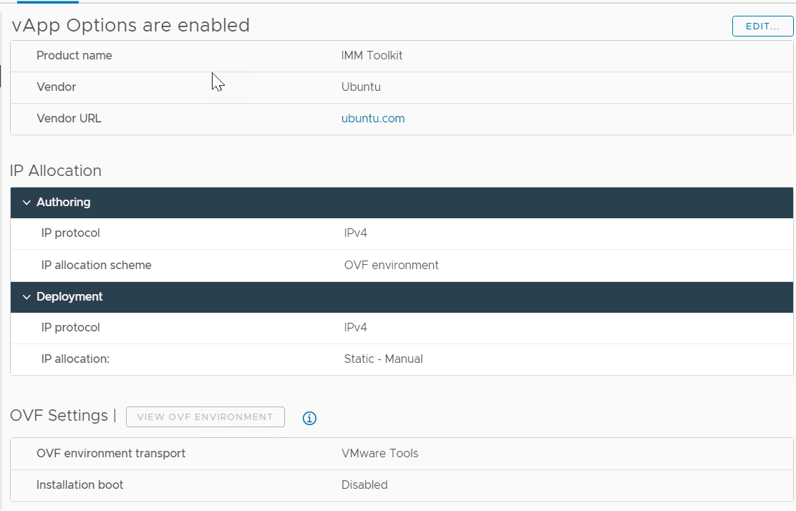

# Intersight Toolkit Setup Instructions

The purpose of this packer example is to build an automation platform to manage Cisco Intersight.  The current example deployes a template in a VMware environment, which then can be used to create an OVA for distribution.

## Updates/News

* 2023-11-18 - v2.0 - Moving to HashiCorp Packer - Guidance from https://tekanaid.com/posts/hashicorp-packer-build-ubuntu22-04-vmware
* 2023-05-04 - Initial Release

## Setup Environment

Install the following packages for Packer.

```sh
sudo apt install mkisofs whois -y
```

## Install Packer

```bash
sudo apt-get update && sudo apt-get install -y gnupg software-properties-common
wget -O- https://apt.releases.hashicorp.com/gpg | gpg --dearmor | \
sudo tee /usr/share/keyrings/hashicorp-archive-keyring.gpg
echo "deb [signed-by=/usr/share/keyrings/hashicorp-archive-keyring.gpg] \
https://apt.releases.hashicorp.com $(lsb_release -cs) main" | \
sudo tee /etc/apt/sources.list.d/hashicorp.list
sudo apt update -y
sudo apt-get install packer -y
```

## Generate a hashed password for the user-data file

Run the command below and when prompted for PASSWORD enter the Password desired for the User Account.

```bash
mkpasswd -m sha-512 --rounds=4096
```

You will get an encrypted password similar to the following:

```bash
Password: $6$KU2P9m78xF3n$noEN/CV.0R4qMLdDh/TloUplmJ0DLnqi6/cP7hHgfwUu.D0hMaD2sAfxDT3eHP5BQ3HdgDkKuIk8zBh0mDLzO1
```

* Copy the user-data.example to user-data

```bash
cd vmware/http/
cp user-data.example user-data
cd ../
```

* Update the hostname, username, password (with the hashed password), 
* Uncomment the authorized-keys if you would like to add a valid ssh-rsa public key for cloud deployments.
* Copy the variables.yaml.example to variables.yaml

```bash
cp variables.yaml.example to variables.yaml
```

* Use the defaults.yaml as an example source and make any modifications you would like to the deployment settings in variables.yaml.

## Setup Packer Sensitive Variables

```bash
export PKR_VAR_virtual_machine_password="same_password_as_mkpasswd_plain_text"
export PKR_VAR_vsphere_password="vcenter_password_plain_text"
```

## Running packer build with hcl

```sh
packer build -force -on-error=ask vmware.pkr.hcl
```

## Troubleshooting

- If packer gets stuck on `Waiting for IP` you may want to check your DHCP server.

## Setup OVF Customization on Virtual Machine




- IP Source
  - Category: Networking
  - Description:
  - Key ID: guestinfo.ip_source
  - Label: IP Source
  - Type: string choice
  - Choice List: "DHCP", "STATIC"
  - Default value: STATIC
- Hostname
  - Category: Networking
  - Description: The Fully Qualified Domain Name
  - Key ID: guestinfo.hostname
  - Label: Hostname
  - Type: string
- IP Address
  - Category: Networking
  - Description:
  - Key ID: guestinfo.ipaddress
  - Label: IP Address
  - Type: string
  - Length: 7 to 15
- Network Prefix
  - Category: Networking
  - Description:
  - Key ID: guestinfo.prefix
  - Label: Network Prefix
  - Type: integer
  - range: 1 to 30
  - Default value: 24
- Gateway
  - Category: Networking
  - Description:
  - Key ID: guestinfo.gateway
  - Label: Gateway
  - Type: string
  - Length: 7 to 15
- DNS Servers
  - Category: Networking
  - Description: Use a comma to separate multiple servers.  i.e. 8.8.4.4,8.8.8.8
  - Key ID: guestinfo.dns
  - Label: DNS Servers
  - Type: string
- DNS Domains
  - Category: Networking
  - Description: Use a comma to separate multiple domains.  i.e. cisco.com,example.com
  - Key ID: guestinfo.domain
  - Label: DNS Domains
  - Type: string
- NTP Servers
  - Category: Networking
  - Description: Use a comma to separate multiple servers.  i.e. 0.pool.ntp.org,1.pool.ntp.org
  - Key ID: guestinfo.ntp
  - Label: NTP Servers
  - Type: string

## Create OVA From VM or VM Template

```powershell
cd %ProgramFiles%\VMware\VMware OVF Tool
ovftool.exe vi://<vcenter-url>/<datacenter>/vm/<vm-folder> %HOMEPATH%\Downloads\imm-toolkitv0.1.ova
```